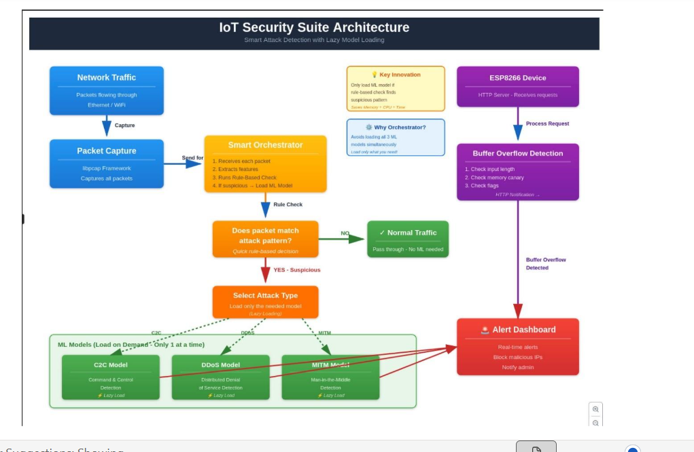

# Network Security Suite (NSS)

A hybrid C++ and Python framework for real-time detection of cyber attacks at the network edge. This library specifically targets **C2C (Command & Control)**, **DDoS (Distributed Denial of Service)**, and **MITM (Man-in-the-Middle)** attacks using specialized feature extractors and machine learning models.

## 🚀 Features

- **Sequential Detection Pipeline**: Optimized flow: C2C → DDoS → MITM.
- **Hybrid Architecture**:
  - **C++ Feature Extractors**: High-performance packet capture and feature extraction using `libpcap`.
  - **Python Orchestrator**: Intelligent analysis using `pandas` and `scikit-learn` models.
- **Lazy Loading**: ML models are loaded into memory only when specific attack patterns are detected, optimizing resource usage.
- **Real-time Processing**: Designed to ingest streaming JSON flow data from standard input.

## 🧠 Detection Logic & Models

The system employs a multi-stage analysis approach:

### 1. C2C (Command & Control)
- **Model**: Random Forest Classifier.
- **Approach**: Analyzes flow metadata to detect beaconing or long-duration low-bandwidth connections.
- **Key Features**: `duration`, `orig_bytes`, `resp_bytes`, `packet_rate`, `byte_ratio`.
- **Logic**: Calculates derived features like `bytes_per_sec` and `pkt_ratio` to identify non-interactive automated traffic.

### 2. DDoS (Distributed Denial of Service)
- **Model**: Random Forest (primary), with fallbacks to SVM or Logistic Regression.
- **Approach**: Detects volumetric anomalies and high-velocity traffic patterns.
- **Key Features**: 
  - `Packets_Per_Sec`, `Bytes_Per_Sec` (Volume)
  - `Unique_IPs`, `Port_Diversity` (Spread)
  - `TCP_Ratio`, `SYN_Flag_Ratio` (Protocol abuse)

### 3. MITM (Man-in-the-Middle)
- **Model**: 3-Class Random Forest (Normal / Suspicious / Attack).
- **Approach**: Inspects ARP (Address Resolution Protocol) traffic for spoofing signs.
- **Key Features**:
  - `mac_ip_inconsistency`: Mismatch between Ethernet and IP headers.
  - `is_broadcast`, `arp_request`, `arp_reply`: Message types.
  - `rtt (avg)`: Round-trip time analysis.

## � Screenshots & Diagrams


*Figure 1: High-level System Architecture*


*Figure 2: Real-time attack detection output in the terminal*

## �📂 Project Structure

```
├── feature_extractor_*.cpp    # C++ sources for network traffic feature extraction
├── compile.sh                 # Script to compile C++ extractors
├── run_orchestrator.py        # Main entry point for the detection engine
├── src/
│   └── network_security_suite/
│       ├── orchestrator.py    # Core logic for routing and classification
│       ├── models/            # ML model definitions (C2C, DDoS, MITM)
│       └── trained_models/    # Directory for serialized model artifacts (.pkl)
└── examples/                  # Usage examples
```

## 🛠 Prerequisites

### System Dependencies
- **g++** (C++11 support required)
- **libpcap** (for packet capture)

```bash
# Ubuntu/Debian
sudo apt-get install g++ libpcap-dev
```

### Python Dependencies
- Python 3.8+
- pandas
- joblib
- scikit-learn

```bash
pip install pandas joblib scikit-learn
```

## 📦 Installation & Compilation

1. **Clone the repository**:
   ```bash
   git clone <repository-url>
   cd Edge-Ml-Library-For-Cyber-Attack-Detection
   ```

2. **Compile the Feature Extractors**:
   Run the provided shell script to compile the C++ components.
   ```bash
   chmod +x compile.sh
   ./compile.sh
   ```
   This will generate three executables:
   - `feature_extractor_c2c`
   - `feature_extractor_mitm`
   - `feature_extractor_ddos`

## 🏃 Usage

The system is designed to run as a pipeline. The C++ extractors capture traffic and output JSON, which is then piped into the Python Orchestrator.

### Running the Orchestrator
The `run_orchestrator.py` script reads JSON lines from **stdin**.

```bash
# Example: Piping data from a feature extractor to the orchestrator
sudo ./feature_extractor_mitm | python3 run_orchestrator.py
```

### Input Data Schema

The orchestrator requires specific JSON structures to correctly route data to the appropriate model.

**C2C Input Format:**
```json
{
  "proto": "tcp",
  "service": "http",
  "duration": 1.5,
  "orig_bytes": 500,
  "resp_bytes": 2000,
  "conn_state": "SF",
  "history": "ShADadFf",
  "orig_pkts": 5,
  "resp_pkts": 4
}
```

**DDoS Input Format:**
```json
{
  "features": {
    "Packets_Per_Sec": 1500,
    "Bytes_Per_Sec": 200000,
    "Unique_IPs": 45,
    "Packet_Size": 64,
    "TCP_Ratio": 0.9,
    "SYN_Flag_Ratio": 0.8
  }
}
```

**MITM Input Format:**
```json
{
  "feature_type": "mitm",
  "ip_address": "192.168.1.50",
  "features": [1, 20, 0.5, 0.1, 1, 1, 0, 2]
}
```
*Note: The array in `features` corresponds to: `[mac_mismatch, packet_count, packet_rate, rtt, is_broadcast, arp_request, arp_reply, opcode]`*

## ❓ Troubleshooting

**"Failed to load [...] model artifacts"**
- Ensure you have the trained model files (`.pkl` or `.joblib`) in `src/models/trained_models/`.
- If you are running from a different directory, ensure the `PYTHONPATH` is set correctly.

**"ImportError: No module named 'src'"**
- Run the script from the project root directory: `python3 run_orchestrator.py`.

## 📄 License
See the `LICENSE` file for details.
